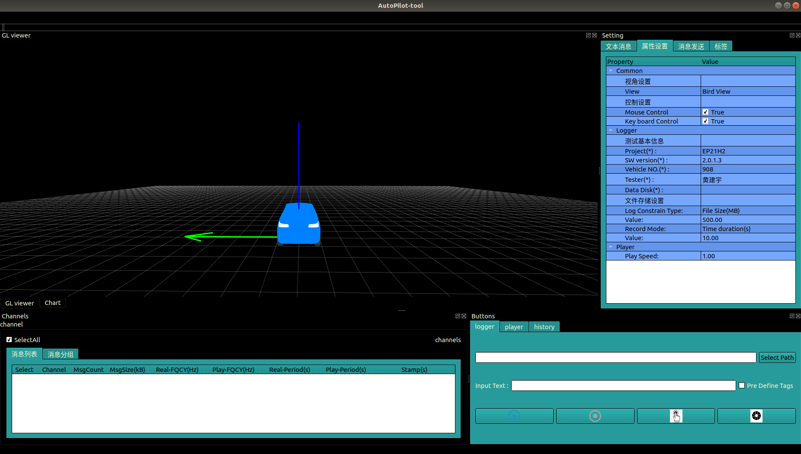

[![Contributors][Huang Jianyu]][contributors-url]
[![Forks][forks-shield]][forks-url]
[![Stargazers][stars-shield]][stars-url]
[![Issues][issues-shield]][issues-url]
[![Apache License][license-shield]][license-url]
[![LinkedIn][linkedin-shield]][linkedin-url]

# Statement
由于工具源码在网上公开，除使用部分开源项目代码外，其余代码均来自我个人，工具本身不包含公司的知识产权，所有与公司有关的内容均从软件包中移除，软件发布遵循Apache协议，任何人均可下载进行修改使用，如使用过程中出现任何问题，本人均不负任何法律责任，如需提供修改及维护，可与本人联系。

<!-- PROJECT LOGO -->
<br />

<p align="center">
  <a href="https://github.com/HjyTiger/AutoPilot-Tool">
    
  </a>


  <h3 align="center">AutoPilot-Tool</h3>

  <p align="center">
    This project is a tool for engineers 
    <br />
    <a href="https://github.com/HjyTiger/AutoPilot-Tool/document/document.md"><strong>Explore the docs »</strong></a>
    <br />
    <br />
    <a href="https://github.com/HjyTiger/AutoPilot-Tool/Video/demo.mp4">View Demo</a>
    ·
    <a href="https://github.com/HjyTiger/AutoPilot-Tool">Report Bug</a>
    ·
    <a href="https://github.com/HjyTiger/AutoPilot-Tool
             ">Request Feature</a>
  </p>

</p>

写在最前面，在工作中经常发现缺少合适的工具而导致的低效。现有的工具不是使用了大量前端技术离调试现场比较远（说服周围的人使用网页端工具阻力也比较大），就是和平台耦合得比较紧密，难以迁移到我们的项目中来（类似百度apollo的dreamView基本需要迁移到apollo平台上才能使用）。本着没有就自己造的思路，我用下班的时间自己写了一个简单的数据可视化的工具，独立于软件平台。

目前发布的工具覆盖的功能还比较简单，不过基本满足大部分测试场景的使用。主要的接口都做了抽象，目前消息收发暂时使用的是一个叫LCM的开源网络通信库，后续会逐渐支持任意的通信基础库。所有消息的可视化，数据条目文本显示及数据的分析曲线绘制的内容都是可扩展的，以模板单元的形式供用户修改。详细参考后文。

工业化和高科技是一条正确但无比艰难的道路，与君共勉。

<!-- TABLE OF CONTENTS -->
<details open="open">
  <summary><h2 style="display: inline-block">Table of Contents</h2></summary>
  <ol>
    <li>
      <a href="#about-the-project">About The Project</a>
      <ul>
        <li><a href="#built-with">Built With</a></li>
      </ul>
    </li>
    <li>
      <a href="#getting-started">Getting Started</a>
      <ul>
        <li><a href="#prerequisites">Prerequisites</a></li>
        <li><a href="#installation">Installation</a></li>
      </ul>
    </li>
    <li><a href="#usage">Usage</a></li>
    <li><a href="#roadmap">Roadmap</a></li>
    <li><a href="#contributing">Contributing</a></li>
    <li><a href="#license">License</a></li>
    <li><a href="#contact">Contact</a></li>
    <li><a href="#acknowledgements">Acknowledgements</a></li>
  </ol>
</details>


<!-- ABOUT THE PROJECT -->
## About The Project



This is a tool for software engineers to view,record and analyse data(sensor data and module data) In the process of software development.

该工具是给开发工程师和测试人员使用。目前包含的功能是车端信号通路的显示和调试，需要显示的数据需要工程师在开放的代码接口中加入。在实车测试的过程中可以动态记录log数据，提供回放排查的功能，包含了数据波动曲线的绘制和标志位显示。也可向车端发送调试信息，该功能也需要工程师在代码中配置。详细配置过程见后文。

`HjyTiger`, `AutoPilot-Tool`, `No`, `hjyneverdie@163.com`, `AutoPilot-Tool`, `auto driving car data visualization tool`


### Built With

* cd AutoPilot-Tool/
* mkdir build
* cd build
* cmake ..
* make


<!-- GETTING STARTED -->
## Getting Started

To get a local copy up and running follow these simple steps.

### Prerequisites

Qt5.10 , Opengl , OpenCV ,protobuf,lib3ds,assimp,lcm,jsoncpp

在发布的版本中包含了部分依赖库的源代码，均来自github，没有包含的部分需要自行前往下载。

### Installation

1. Clone the repo
   ```sh
   git clone https://github.com/HjyTiger/AutoPilot-Tool
   ```
   
2. Install
   ```sh
   * cd AutoPilot-Tool/
   * mkdir build
   * cd build
   * cmake ..
   * make
   ```


<!-- USAGE EXAMPLES -->
## Usage

Welcome to contribute to the project.Some of my  colleague have told me about some  "undefined reference" cases.Beacuse  of my CXX compiler is gcc-4.8.5(our company use this version). So if  your

gcc is not gcc-4.8.5, you have to  compiler all the third party libraries by using your gcc. And the  "undefined reference"  cases mainly caused because of the  AutoPilot-Tool/Communicate/message/protobuf/sample/geometric.pb.h and  geometric.pb.cc, these file is generated by protoc(Which is a tool of  Google's protobuf) from geometric.proto. I use gcc-4.8.5 compile protobuf-3.3, and I find it not  compatible with other version of  gcc. So you have to regenerate  geometric.pb.h and geometric.pb.cc by using you protoc(which compiled  by your gcc compiler).

Some other problems are from openCV,I used latest version openCV-4.5,And I put the .h file in AutoPilot-Tool/3rdparty/x86/include, If your opencv is not this version,you have to replace the opencv include fold with yours.

I have upload  this project for the first time, And not find these problem at  beginning,I will fix these problems later and Improve the documentation.

I add some resources in the fold Resources, you shoule add 3Dmaterial ,Tags.json to the same level directory with AutoPilot-tool.

 Hope it will help, Good luck.


界面整体用dock组织，窗口间可以随意拖拽和覆盖，双击打开后，工具界面主要包含四个板块：

1.左上角：显示界面，包含几何数据的可视化和数据波动曲线显示窗口。

2.右上角：设置窗口，包含文本消息的更新显示窗口，软件属性设置窗口，消息发送窗口和log标签窗口。

3.左下角：消息通道显示窗口，汇总显示和分组显示。

4.右下角：按钮操作窗口，包含数据记录时的按钮窗口和数据回放时的按钮窗口。

_For more examples, please refer to the [Documentation](./document/document.md)_


<!-- ROADMAP -->
## Roadmap

这里先简单介绍以下软件当前版本已有的功能：

* 传感器数据可视化，包含但不限于：摄像机，激光雷达，毫米波雷达，定位和模块间收发的中间数据；
* 数据波动检测，以图表的形式实时显示车载端数据的波动情况；
* 数据log记录及打标签，测试人员可在实车测试时根据实际情况对数据做跟踪记录；
* 数据回放，记录数据回放排查；
* 往车端发送指令


后续版本会逐渐加入自动生成测试报告，自动打标签和往云端发送数据的功能。


<!-- CONTRIBUTING -->
## Contributing

Contributions are what make the open source community such an amazing place to be learn, inspire, and create. Any contributions you make are **greatly appreciated**.

1. Waiting for more contributors


<!-- LICENSE -->
## License

Distributed under the Apache License. See `LICENSE` for more information.


<!-- CONTACT -->
## Contact

- hjyneverdie[@163.com] - email

Project Link: [https://github.com/HjyTiger/AutoPilot-Tool ]


<!-- ACKNOWLEDGEMENTS -->
## Acknowledgements

* []()
* []()
* []()


<!-- MARKDOWN LINKS & IMAGES -->
<!-- https://www.markdownguide.org/basic-syntax/#reference-style-links -->
[contributors-shield]: https://img.shields.io/github/contributors/github_username/repo.svg?style=for-the-badge
[contributors-url]: https://github.com/github_username/repo/graphs/contributors
[forks-shield]: https://img.shields.io/github/forks/github_username/repo.svg?style=for-the-badge
[forks-url]: https://github.com/github_username/repo/network/members
[stars-shield]: https://img.shields.io/github/stars/github_username/repo.svg?style=for-the-badge
[stars-url]: https://github.com/github_username/repo/stargazers
[issues-shield]: https://img.shields.io/github/issues/github_username/repo.svg?style=for-the-badge
[issues-url]: https://github.com/github_username/repo/issues
[license-shield]: https://img.shields.io/github/license/github_username/repo.svg?style=for-the-badge
[license-url]: https://github.com/github_username/repo/blob/master/LICENSE.txt
[linkedin-shield]: https://img.shields.io/badge/-LinkedIn-black.svg?style=for-the-badge&logo=linkedin&colorB=555
[linkedin-url]: https://linkedin.com/in/github_username
