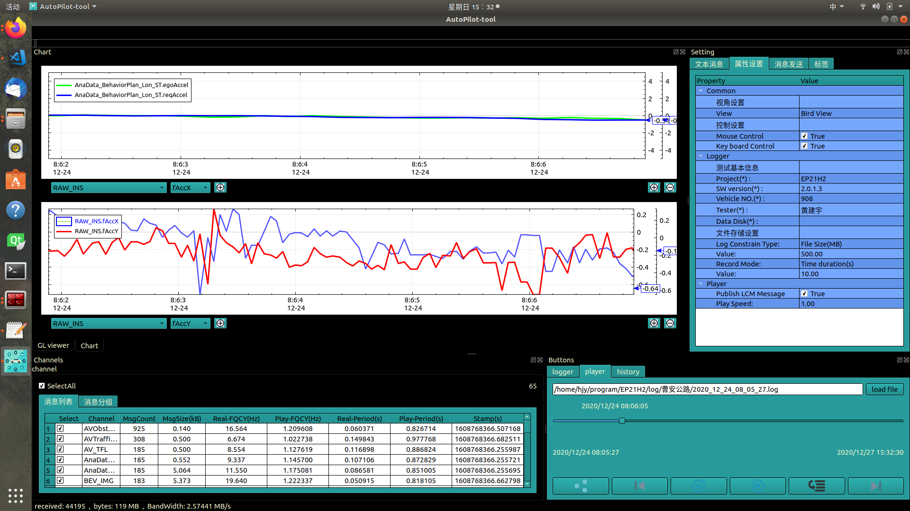
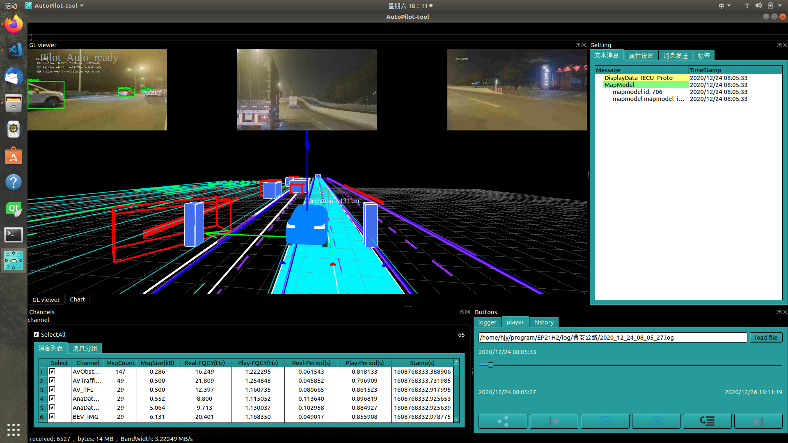
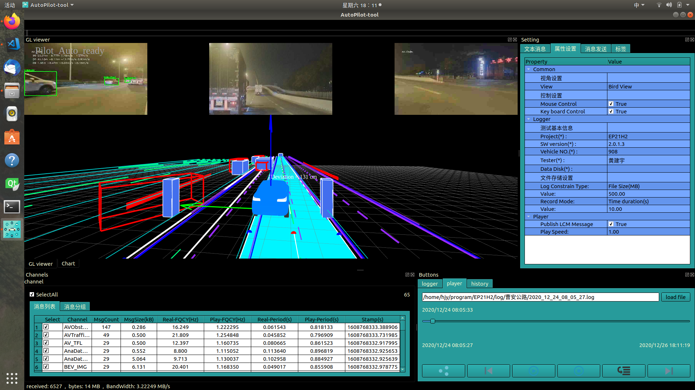
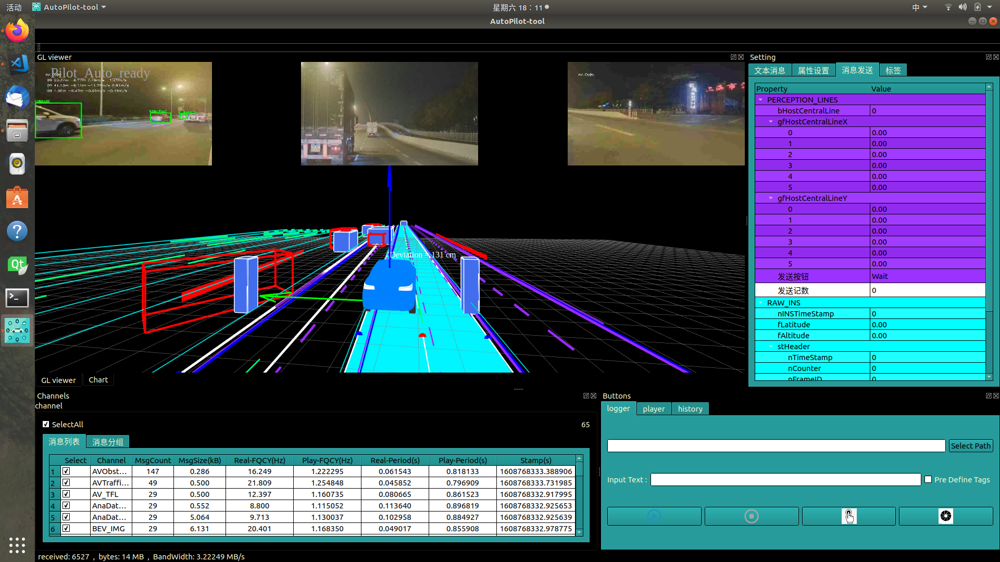
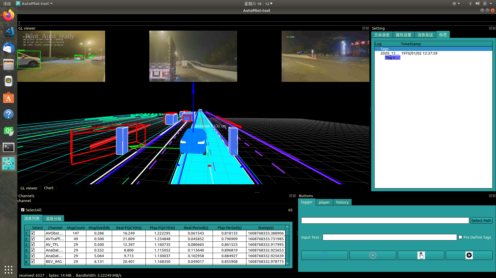
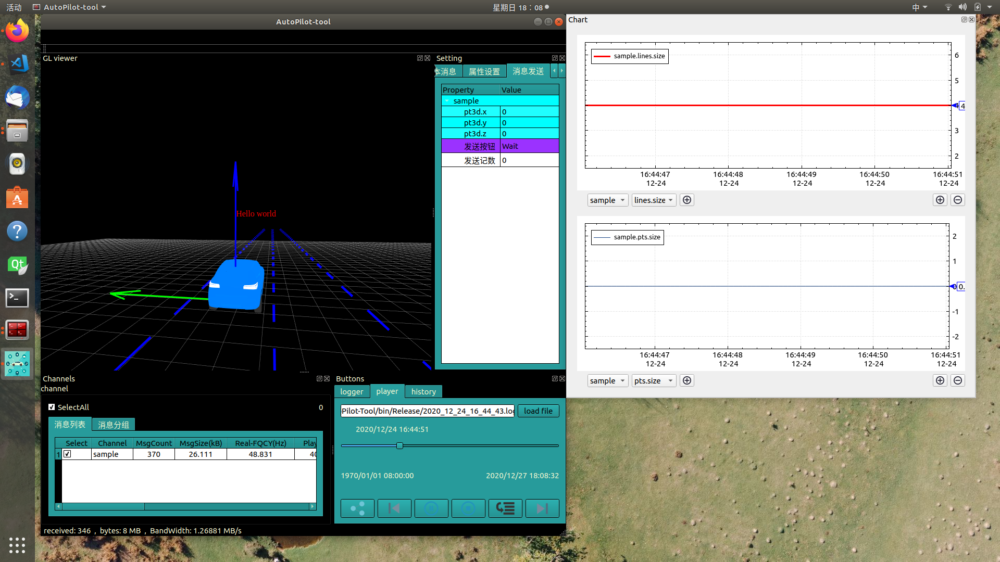

# AutoPilot-Tool

## Statement
由于工具源码在网上公开，除使用部分开源项目代码外，其余代码均来自我个人，工具本身不包含公司的知识产权，所有与公司有关的内容均从软件包中移除，软件发布遵循Apache协议，任何人均可下载进行修改使用，如使用过程中出现任何问题，本人均不负任何法律责任，如需提供修改及维护，可与本人联系。

## Introduction
这是一个简单的用于智能驾驶开发过程中的数据可视化工具，包含了一部分开发和测试需要用到的功能，包括：传感器数据的可视化，消息打印，数据log记录，数据回放分析，数据波动曲线绘制与观测。本工具面向的对象为开发工程师和测试工程师。工具本身实现了基本的功能框架，实际需要显示和分析的数据接口需要软件工程师自行添加，后续会详细说明添加方法。目前功能比较简单，后续视情况会逐渐添加功能包括：自动生成测试报告，自动打标签，数据仿真等。

## Interface
打开工具后出现一个主窗口，主窗口下一共划分为四个子窗口，分别是：数据可视化窗口，属性显示及设置窗口，消息通道记录窗口和按钮窗口。为了方便使用，四个窗口均用dock实现，使用过程中可随意脱离合并。

### 数据可视化窗口
这个窗口包含了用于OpenGL显示几何数据的图形化窗口和Plot显示数据波动的绘图窗口。

#### 图形化窗口

图形显示以车辆后轴中心为坐标原点，鼠标左键可以移动视角，旋转中心为车辆后轴中心。键盘w,a,s,d,q,e分别对应前，左，后，右，上，下移动相机视角。快捷键：G（是否开启网格），C（是否显示坐标轴），M（是否显示观测标线），P（更改透视投影模式，正交投影或仿射投影），F（相机移动方式），L（记录当前相机信息），T（是否显示文本消息），I（是否显示图像消息）。

#### 波动曲线绘制窗口


左下角选择消息名称和对应的消息字段，点加号添加到观测量中，图表会实时绘制当前值的变化波动情况，右下角可添加和删除观测窗口的数量。
在图表上点击鼠标右键可以选择编辑曲线类型，暂定开始播放，合并和分离曲线y坐标轴，删除曲线等操作；点击左上角曲线标签，双击曲线可修改颜色，鼠标右键可修改数据点绘制形状。

### 属性显示及设置窗口
这个窗口一共包含了四个子窗口：文本显示窗口，属性设置窗口，消息发送窗口和标签记录窗口。
#### 文本显示窗口

该窗口显示的内容需要工程师在代码中添加，每条传感消息为一个条目，下拉窗口为所有需要动态显示的信息，这个窗口可用作一些关键标志位的显示和调试文本消息的打印。

#### 属性设置窗口

该窗口主要用于设置工具的一些外观，包括设置观察视角，锁定键盘和鼠标，改变播放速度等，更多功能会持续增加。

#### 消息发送窗口

该窗口用于编辑往车端发送的调试指令信号，信号通路根据实际平台配置，消息类型和需要修改发送的字段需要工程师在代码中进行修改。

#### 标签记录窗口

该窗口用于记录数据时显示数据标签。

### 消息通道记录窗口

该窗口用于显示当前收到或者播放的消息的信息，包括消息：分组，帧数，带宽，频率，时间戳，两个tab窗口分别：按字母排序汇总显示所有消息，按分组并列显示消息。

### 按钮窗口
按钮窗口集中了工具主要的按钮功能，分别是记录logger的窗口按钮，播放数据的窗口按钮。

#### Logger按钮
从左往右：第一个按钮为开始记录log（log名称在上方窗口中输入），第二个按钮为停止记录log，第三个按钮为记录当前数据段（从按下按钮的时刻之前一段时间或者一定大小的包或者一定数量的消息，具体设置在option窗口中进行设置）的所有数据。第四个按钮为打标签按钮（测试过程中发现问题做记录，标签名称在上方窗口中输入），其上方有个选项，勾选上能够呼出预定义标签名称。

#### Player按钮
从左往右：第一个按钮为修改播放模式，第二个按钮为log切换，第三个按钮为播放暂停按钮，第四个按钮为停止按钮，第五个按钮和第六个按钮功能暂无定义。

## Code Edit
该工具面向对象为工程师，所有需要定制化显示的消息和内容均需工程师在代码中修改和添加。
在工程文件夹下方名为User的文件夹为用户工程师添加修改的接口，其余部分代码为软件功能框架，除需添加功能外，原则上不要修改。

### 用户接口
目前消息的收发通过一个开源的网络通信库，名字叫Lcm，该库可以在车载端ECU上运行并发送消息包，下载地址为：https://github.com/lcm-proj/lcm

这里我们使用protobuf作为通信消息的定义。

```
syntax = "proto2";

option optimize_for = LITE_RUNTIME;

package sample;

message Point3D {
  optional double x = 1 [default = nan];
  optional double y = 2 [default = nan];
  optional double z = 3 [default = nan];
}

message Line{
  repeated Point3D pts = 1;
}

message Lines{
  
}

message Sample{
  repeated Line    lines = 1;
  repeated Point3D pts   = 2;
}
```
生成的头文件和源文件放到AutoPilot-Tool/Communicate/message/protobuf/sample 中。

User文件夹下为团队中不同模块划分了单独的文件夹，每个文件夹中有对应的添加内容的文件。
对于需要显示的某一条消息，需要这么几个步骤：1.将消息类的头文件包含进来；2.对消息进行注册和设置基本属性；3.对消息独立显示的功能进行代码定制修改。

以Sample文件夹为例：
1.首先需要将消息包含到代码定义中，这里统一放到 SampleMessage_Type.h文件中，内部添加头文件及发送消息的名称定义。
```
#include "Communicate/message/protobuf/sample/geometric.pb.h"
const std::string Sample_proto("sample");
```
2.对消息进行注册。
```
#pragma once
#include "Model/Model_Constants.h"
#include "Model/Model_DataManager.h"
#include "User/Sample/SampleMessage_Type.h"

const std::string Sample_groupName("Sample");
const QColor Sample_groupColor(67,110,238);
 
namespace tool{

inline void registerMessage_Sample(tool::DataManager * dataManager){
    dataManager->registerInformation<sample::Sample>(Sample_proto,
                                                     Sample_groupName,
                                                     Sample_groupColor,
                                                     QColor(255,255,255),
                                                     true); 
}
}
```
registerInformation函数为模板函数，用法如上，接口解释如下
```
template <typename T>
bool DataManager::registerInformation(const std::string & infoName, //消息名称
                                      std::string         groupName, //分组名称
                                      QColor              groupColor, //分组颜色
                                      QColor              infoColor, //消息颜色
                                      bool                isUpdateCommonInfo, //是否更新公共消息，一般设为false
                                      bool                isPlotAtBeginning, //是打开否默认绘制数据波动曲线
                                      tool::SampleMode    sampleMode, 消息采样模式：按时间间隔采样，按帧数采样
                                      int                 sampleCount, 采样帧间隔
                                      double              sampleTimeInterval //采样时间间隔
                                      );
```
这里为了满足更多对消息定制化的需求，另外提供了一个重载的函数接口：
```
template <typename T>
bool DataManager::registerInformation(const Message_Config & msgConfig);
```
```
class Message_Config
{
public:
    Message_Config():
    infoName(""),groupName(""),
    groupColor(255,255,255),infoColor(255,255,255),
    m_isUpdateCommonInfo(false),
    sampleMode(sm_time),sampleCount(0),sampleTimeInterval(0.05) //0.05 second
    {}
    ~Message_Config()
    {}
public:
    std::string infoName;  //消息名称
    std::string groupName;  //分组名称
    QColor      groupColor; //分组颜色
    QColor      infoColor;  //消息颜色
    bool        m_isUpdateCommonInfo;  //是否更新公共消息，一般设为false
    tool::SampleMode  sampleMode;
    int               sampleCount;
    double            sampleTimeInterval;
    std::map<std::string,ValueConfig> m_value_config; //设定每一个采样字段的绘制要求，后文说明
};
```

3.添加定制功能
这里定制功能包括：几何图形的显示，文本窗口的显示，发送窗口的编辑设置，绘图数据的注册
#### 几何图形的显示
这部分功能的定制放到Sample_ExtractGLdata.h文件中，用户需要特化一个模板函数,如下：

```
template<typename T>
bool extract_gl_data(GL_Data & gl_data,
                     T       & typa_data){
    return false;
}
```
函数的输入输出参数有GL_Data和sample::Sample的实例对象。其中GL_Data既是输入参数也是输出参数，输入参数是由外围接口设置好之后传入本接口供调用者使用的。
```
class GL_Data{
public:
    //input  输入参数
    int64_t  timestamp; //消息时间戳      
    /* loc*/
    double transMat_UTMToEC[3][4]; //实时的UTM坐标系转自车坐标系的转换矩阵
    /* ui*/
    int window_width,window_height; //当前窗口宽高，用于给用户设定文字绘制的位置。
    //output 输出参数
    std::vector<int>       attribute_bytes;   //数据位宽，一般为std::vector<int> {3,4} ,分别表示3位x,y,z位置位和r,g,b,a颜色位
    std::vector<GL_Geo_Element>     geo_elements;  //几何数据元素
    std::vector<GL_Text_Element>    text_elements; //文本数据元素
    std::vector<GL_Image_Element>   image_elements; //图像数据元素
    std::vector<GL_Texture_Element> texture_elements; //纹理数据元素
};
```
先解释几何数据元素，每条消息需要绘制的几何单元，一条消息可能包含不同的几何单元，包括：点，线段，线条，三角面，四边形面等

```
class GL_Geo_Element{
public:
    int                    mode; //绘制元素类型：
    std::vector<GLfloat >  geo_data; //绘制的数据内容
    GLsizei                data_size; //数据大小
    GLfloat                width;  //绘制宽度
    QColor                 color;  //暂时无用

};
```
这里geo_data为一个一维的浮点型数组，每7位（对应的位数同attribute_bytes中的设置一致，也可以是6位：x,y,z,r,g,b）代表一个点，绘制的顺序为按照mode设定的模式按点依次绘制，具体的绘制方法及顺序同opengl缓冲区数组的绘制方法一致。mode定义的绘制类型与Opengl预定义的基本类型对应，分别为:
```
#define GL_POINTS				0x0000
#define GL_LINES				0x0001
#define GL_LINE_LOOP				0x0002
#define GL_LINE_STRIP				0x0003
#define GL_TRIANGLES				0x0004
#define GL_TRIANGLE_STRIP			0x0005
#define GL_TRIANGLE_FAN				0x0006
#define GL_QUADS				0x0007
#define GL_QUAD_STRIP				0x0008
#define GL_POLYGON				0x0009
```
这里我截一张opengl绘制的简要说明图


需要在窗口中添加文本信息则是GL_Text_Element类型：
```
class GL_Text_Element{
public:
    QString  text_data;  //文本数据
    int      width;      //字符大小
    int      loc_x,loc_y; //在屏幕中的位置，左上角（0,0），水平x，竖直y
    QColor   color;       //文本颜色
};
```

以Sample为例：
```
template<>
inline bool extract_gl_data<sample::Sample>(GL_Data           & gl_data,
                                            sample::Sample  &   sampleProto){
    std::vector<int> attribute_bytes{3,4}; // x,y,z r,g,b,a
    gl_data.attribute_bytes.swap(attribute_bytes);
    gl_data.geo_elements.clear();

    GL_Geo_Element oneLine;
    oneLine.width = 5;
    oneLine.mode = GL_LINES;

    for(int i = 0;i < sampleProto.lines_size();i++){
        const sample::Line & line = sampleProto.lines(i);
        oneLine.geo_data.resize(line.pts_size() * 7,0.0);
        for(int j = 0;j < line.pts_size();j++){
            int offset = 7*j;
            const sample::Point3D & pt3d = line.pts(j);
            oneLine.geo_data[offset] = pt3d.x();
            oneLine.geo_data[offset + 1] = pt3d.y();
            oneLine.geo_data[offset + 2] = pt3d.z();
            oneLine.geo_data[offset + 5] = 1.0;  //blue
            oneLine.geo_data[offset + 6] = 1.0; 
        }
        gl_data.geo_elements.push_back(oneLine);
    }
    GL_Text_Element text_ele;
    text_ele.text_data = QString("Hello world");
    text_ele.color = QColor(255,0,0);
    text_ele.loc_x = gl_data.window_width / 2;
    text_ele.loc_y = gl_data.window_height / 2;
    gl_data.text_elements.push_back(text_ele);
    return true;
}
```
这里是绘制若干线段。其余元素的绘制只需修改mode就行。并在屏幕中间显示"Hello world"。

#### 文本显示
这里还是以sample为例：
```
template<>
inline bool extract_Text_group<sample::Sample>(std::vector<std::string> & text_group,
                                               Text_Parameter           & text_para,
                                               sample::Sample            & typa_data){
    /* title setting*/
    text_para.title_name = Sample_proto;   //设置文本标题
    text_para.title_color = QColor::fromRgb(0,255,0,125); //设置标题颜色
    text_group.clear();
    text_group.emplace_back("Hello World");
    return true;
}
```
#### 发送窗口的编辑设置
内容放置于 Sample_SendMessage.h
```
template<>
inline bool sendMessageEditor<sample::Sample>(QNodeProperty *       messageNode,
                                              Message_Parameter &   messagePara,
                                              sample::Sample    &   sample){
    if(messageNode == nullptr){
        return false;
    }else{/* go on*/}
    messagePara.title_color = QColor(0,255,255);
    sample::Point3D * pt3D = sample.add_pts();
    float x = messageNode->Int64Property("pt3d.x");
    float y = messageNode->Int64Property("pt3d.y");
    float z = messageNode->Int64Property("pt3d.z");
    pt3D->set_x(x);
    pt3D->set_y(y);
    pt3D->set_z(z);
    return true;
}
```
QNodeProperty位窗口编辑消息的数据来源，这里只需按照上面代码显示的设置消息的格式对消息结构体进行赋值操作即可。例子中对sample的一个数据点进行赋值，在窗口中点击发送即可将消息发送出去。

#### 绘图数据的注册
内容放置于 Sample_PlotValue.h
```
inline bool extract_PlotValue<sample::Sample>(ValuePool      & valuePool,
                                              sample::Sample & sample){
    valuePool.setColor(QColor(0,0,255));

    valuePool.value("pts.size") = static_cast<double>(sample.pts_size());
    valuePool.value("lines.size") = static_cast<double>(sample.lines_size());
    return true;
}
```
这里只对sample数据中的点和线的数量进行检测绘制，其他数据量均可用类似方法进行添加。

按照sample的方式添加好上述内容之后，编译运行即可使用功能，效果图如下：


